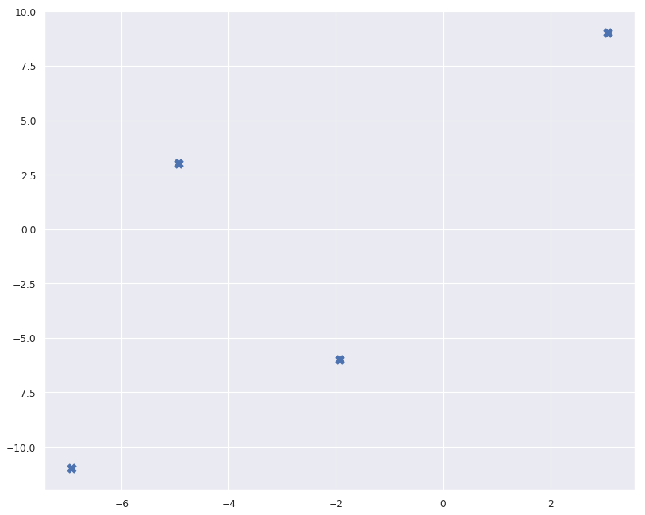
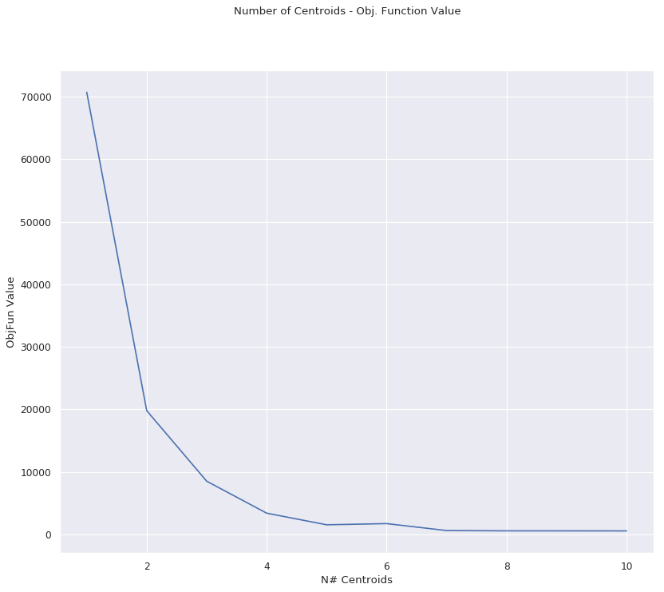
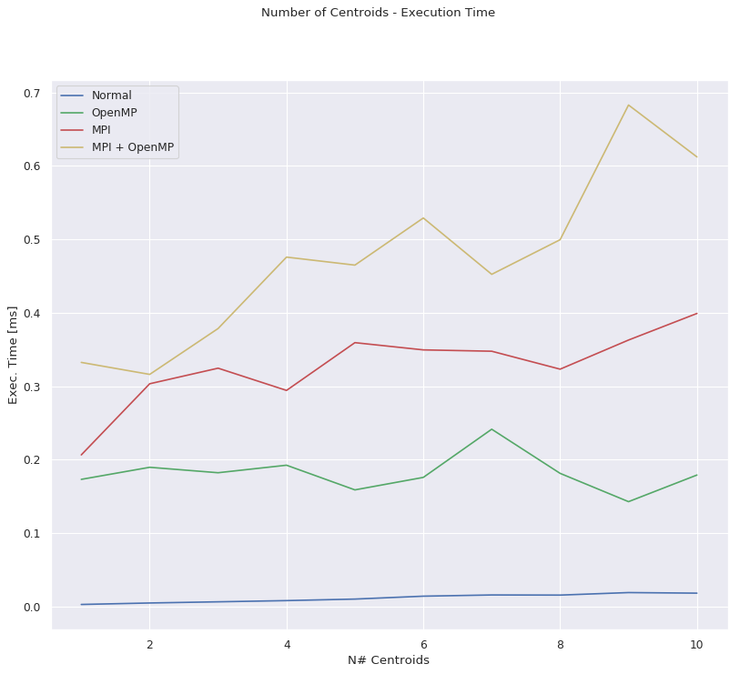
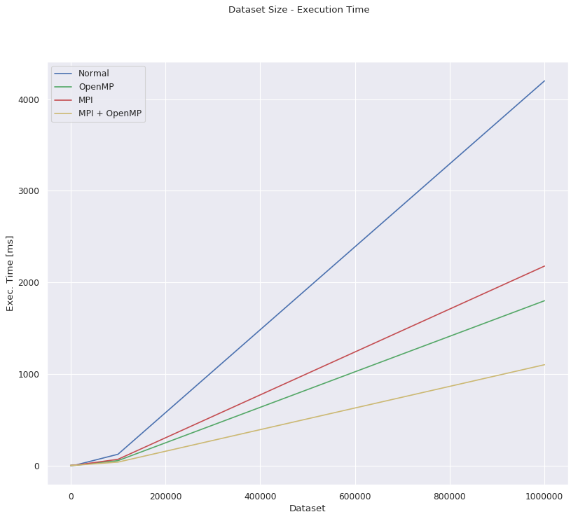

# K-Means Clustering with OpenMP and MPI

### Implement the k-means clustering algorithm in OpenMP/MPI, trying to maximize the performance (reduce the execution time) by carefully exploiting the resources within one computing node with multiple processing cores (OpenMP) and across computing nodes (MPI).

Optional: implement the same algorithm in Apache Flink and compare the performance of the two implementations (processing time and scalability) under various workloads.

-------------------------------------------------------------------------------------------------------------------------


```python
import csv
import random
import sys

import numpy
import os  # We need this module
import matplotlib.pyplot as plt
import seaborn as sns;
from sklearn.datasets.samples_generator import make_blobs
sns.set()  # for plot styling

#Samples
N_SAMPLES = 100000

# Get path of the current dir, then use it to create paths:
CURRENT_DIR = os.path.dirname("__file__")
file_path = os.path.join(CURRENT_DIR, 'dataset_display/dataset.csv')
initial_dataset_path = os.path.join(CURRENT_DIR, 'dataset_display/initialdataset.csv')
initial_centroids_path = os.path.join(CURRENT_DIR, 'dataset_display/initialcentroids.csv')
new_dataset_path = os.path.join(CURRENT_DIR, 'dataset_display/newdataset.csv')
new_centroids_path = os.path.join(CURRENT_DIR, 'dataset_display/newcentroids.csv')
objfun_path = os.path.join(CURRENT_DIR, 'dataset_display/objfun.csv')
exectimes_path = os.path.join(CURRENT_DIR, 'dataset_display/exectimes.csv')
results_100_path = os.path.join(CURRENT_DIR, 'dataset_display/results_100/results.csv')
results_1K_path = os.path.join(CURRENT_DIR, 'dataset_display/results_1K/results.csv')
results_10K_path = os.path.join(CURRENT_DIR, 'dataset_display/results_10K/results.csv')
results_100K_path = os.path.join(CURRENT_DIR, 'dataset_display/results_100K/results.csv')
results_1M_path = os.path.join(CURRENT_DIR, 'dataset_display/results_1M/results.csv')
results_10M_path = os.path.join(CURRENT_DIR, 'dataset_display/results_10M/results.csv')

fig_width = 12
fig_height = 10
```

# Initial Dataset

## Display the points in the Initial Dataset:

We have an Initial Dataset of 100000 points(later on we'll be using different sizes), randomly generated by a custom Python script. These points are already somehow divided in clusters so that we can more easily test the K-Means Clustering algorithm.


```python
print('X,Y')
with open(initial_dataset_path) as csvfile:
    reader = csv.DictReader(csvfile)
    for i,row in enumerate(reader):
        print(row['X'], row['Y'])
        if(i >= 10):
            break
            
print("Total points: %s" % format(N_SAMPLES,'d'))
```

    X,Y
    4.762006 -7.700549
    4.490764 -8.202433
    -1.384802 2.850730
    -1.411994 -6.885759
    0.045029 1.578344
    -7.419469 9.258043
    -6.915910 9.343622
    -7.663262 8.672174
    -2.618907 -6.364270
    -1.369107 -8.103168
    -7.965163 9.759896
    Total points: 100000


## And now we plot the initial dataset:

By plotting the Dataset, we can see that is indeed form by 4 clusters easily observable. We'll later test the K-Means Clustering algorithm and see if it can also individuate the clusters.


```python
x = numpy.zeros(N_SAMPLES)
y = numpy.zeros(N_SAMPLES)

#Read the dataset from the CVS file
with open(initial_dataset_path) as csvfile:
    reader = csv.DictReader(csvfile)
    i = 0
    for row in reader:
        x[i] = row['X']
        y[i] = row['Y']
        #print(x[i], y[i])
        i=i+1

#Plot the read dataset
plt.figure(figsize=(fig_width, fig_height), dpi= 80, facecolor='w', edgecolor='k')
plt.scatter(x[:], y[:], s=1)
plt.show()
```


## Initial Centroids

The Initial Centroids are randomply placed at runtime, however a centroids will be recreated if it is too close to another centroid. The initial placing of the centroids is of fundamental importance to the result of the K-Means Clustering algorithm execution on a given dataset. Lets print the centroids: 


```python
print('Cluster,X,Y')
centroids = 0
with open(initial_centroids_path) as csvfile:
    reader = csv.DictReader(csvfile)
    for row in reader:
        print(centroids, row['X'], row['Y'])
        centroids = centroids + 1
print("Total centroids: %d" % centroids)
```

    Cluster,X,Y
    0 -8.933069 -6.976418
    1 -8.933069 -7.976418
    2 2.066931 -5.976418
    3 -4.933069 2.023582
    Total centroids: 4


And now we plot them:


```python
x = numpy.zeros(centroids)
y = numpy.zeros(centroids)

#Read the dataset from the CVS file
with open(initial_centroids_path) as csvfile:
    reader = csv.DictReader(csvfile)
    i = 0
    for row in reader:
        x[i] = row['X']
        y[i] = row['Y']
        #print(x[i], y[i])
        i=i+1

#Plot the read dataset
plt.figure(figsize=(fig_width, fig_height), dpi= 80, facecolor='w', edgecolor='k')
plt.scatter(x[:], y[:], marker="X", s=100)
plt.show()
```





# Plotting both Dataset and Centroids

 We've run the K-Means Clustering Algorithm on the initial dataset and got new centroids each associated to a cluster. So we now plot the resulting clusters separated by a random color and their centroids:


```python
def random_color():
    return numpy.random.rand(3,)
```


```python
x = numpy.zeros(N_SAMPLES)
y = numpy.zeros(N_SAMPLES)
c = numpy.zeros(N_SAMPLES)
cx = list()
cy = list()

plt.figure(figsize=(fig_width, fig_height), dpi= 80, facecolor='w', edgecolor='k')

# Read the new centroids from the CVS file
with open(new_centroids_path) as csvfile:
    reader = csv.DictReader(csvfile)
    for row in reader:
        cx.append(float(row['X']))
        cy.append(float(row['Y']))

# Read the new dataset from the CVS file
with open(new_dataset_path) as csvfile:
    reader = csv.DictReader(csvfile)
    i = 0
    for row in reader:
        x[i] = row['X']
        y[i] = row['Y']
        c[i] = row['Cluster']
        # print(x[i], y[i])
        i = i + 1

minK = c.min()
maxK = c.max()
k = (int)(maxK - minK + 1)

# plot the points for each cluster with a different color
for i in range(k):
    x2 = list()
    y2 = list()

    for j in range(N_SAMPLES):
        if c[j] == i:
            x2.append(x[j])
            y2.append(y[j])

    # Plot the read dataset
    color1 = random_color()
    color2 = random_color()
    plt.scatter(x2[:], y2[:], c=color1, s=50)
    plt.scatter(cx[i], cy[i], c=color1, marker="X", edgecolor=color2, s=100)
plt.show()
```


## Running Modes: Normal, OpenMP, MPI, MPI + OpenMP

The program written in C actually executes four different versions of the K-Means Clustering Algorithm. They run sequentially one at a time, but they use the same initial dataset and the same random pair of initial centroids. The initial position of the centroids is of vital importance to the result of the execution so is important that all four versions use the same set of centroids so that we can have a meaningful comparison in performance.
All four versions will produce the same result and same objective function value, but they will have different execution times. 

We've set the maximum number of cores for the OpenMP verision (4 on this PC), and 4 parallel nodes for the MPI (and MPI+OpenMP) Version. As expected the OpenMP version perform much better that the sequential version, while with MPI is not always the case, here are the results of a single execution on this dataset:


```python
print('Execution Times:\n')
t = numpy.zeros(4)
with open(exectimes_path) as csvfile:
    reader = csv.DictReader(csvfile)
    for i,row in enumerate(reader):
        t[i] = row['Time']
            
print('Normal Execution --> ' + str(t[0]*1000) + 'ms')
print('OpenMP Execution --> ' + str(t[1]*1000) + 'ms')
print('MPI Execution    --> ' + str(t[2]*1000) + 'ms')
print('MPI + OpenMP Execution    --> ' + str(t[3]*1000) + 'ms')
```

    Execution Times:
    
    Normal Execution --> 89.87299999999999ms
    OpenMP Execution --> 43.096000000000004ms
    MPI Execution    --> 887.715ms
    MPI + OpenMP Execution    --> 2597.859ms


While the value of the Objective Function is:


```python
objfun = numpy.zeros(4)
with open(objfun_path) as csvfile:
    reader = csv.DictReader(csvfile)
    for i,row in enumerate(reader):
        objfun[i] = row['ObjFun']
            
print('ObjectiveFunction value --> ' + str(objfun[0]))
```

    ObjectiveFunction value --> 71883.648438


------------------------------------------
------------------------------------------

# AmazonAWS Starcluster Results

All the executions and tests explained below were run on a cluster of **four c3.xlarge EC2 Nodes** on Amazon AWS by using the Starcluster open source cluster-computing toolkit. Each node (c3.xlarge) is a powerful machine with 4 cores and 8GB of RAM.

### Cumulative Execution Results

By running a bach script we were able cumulate a large quantity of execution results (more than 4000 executions). For consistency we've run all four different versions of the K-Means Clustering Algorithm sequentially one at a time on the same initial dataset and the same random pair of initial centroids (changing every cycle). That way the results of each execution can be compered with the executions of the other three versions of the algorithm. For each executions we've stored the number of centroids, the execution mode(algorithm version), the execution time and the obj function result.

### 1) Relation between number of centroids and obj function value
Let's average the executions results in the large dataset described above and plot the relation between the number of centroids and the obj function value. The execution were made with a number of centroids between 1 and 10.


```python
def getResultsData(fname):
    row_count = 0
    with open(fname) as csvfile:
        row_count = sum(1 for line in csvfile)
    print ("Rows in the results file: " + str(row_count))
    EXECUTIONS = int((row_count - 1)/4)  

    n_c      = numpy.zeros(EXECUTIONS)
    openmp_c = numpy.zeros(EXECUTIONS)
    mpi_c    = numpy.zeros(EXECUTIONS)
    mpi_mp_c = numpy.zeros(EXECUTIONS)

    n_t      = numpy.zeros(EXECUTIONS)
    openmp_t = numpy.zeros(EXECUTIONS)
    mpi_t    = numpy.zeros(EXECUTIONS)
    mpi_mp_t = numpy.zeros(EXECUTIONS)

    n_of      = numpy.zeros(EXECUTIONS)
    openmp_of = numpy.zeros(EXECUTIONS)
    mpi_of    = numpy.zeros(EXECUTIONS)
    mpi_mp_of = numpy.zeros(EXECUTIONS)

    # Read the new centroids from the CVS file
    with open(fname) as csvfile:
        reader = csv.DictReader(csvfile)
        i1,i2,i3,i4=0,0,0,0
        for i,row in enumerate(reader):
            mode = int(row['Mode'])
            #print(mode + "-" + str(i))

            #Normal Execution
            if mode == 0:
                n_c[i1]  = float(row['K'])
                n_t[i1]  = float(row['Time'])
                n_of[i1] = float(row['ObjFun'])
                i1 = i1 + 1
            #OpenMP Execution
            elif mode == 1:
                openmp_c[i2]  = float(row['K'])
                openmp_t[i2]  = float(row['Time'])
                openmp_of[i2] = float(row['ObjFun'])
                i2 = i2 + 1
            #MPI Execution
            elif mode == 2:
                mpi_c[i3]  = float(row['K'])
                mpi_t[i3]  = float(row['Time'])
                mpi_of[i3] = float(row['ObjFun'])
                i3 = i3 + 1
            #MPI + OpenMP Execution
            elif mode == 3:
                mpi_mp_c[i4]  = float(row['K'])
                mpi_mp_t[i4]  = float(row['Time'])
                mpi_mp_of[i4] = float(row['ObjFun'])
                i4 = i4 + 1
    return EXECUTIONS, n_t, openmp_t, mpi_t, mpi_mp_t, n_c, openmp_c, mpi_c, mpi_mp_c, n_of

EXECUTIONS, n_t, openmp_t, mpi_t, mpi_mp_t, n_c, openmp_c, mpi_c, mpi_mp_c, n_of = getResultsData(results_10K_path)
                
x_val = numpy.zeros(10)
y_val = numpy.zeros(10)

#Calc the mean values
for i in range(0,10):
    x_val[i] = i + 1
    #print(str(i))
    
    #Iterate all the executions for each centroid number
    for j in range(EXECUTIONS):
        if n_c[j] == i+1:
            y_val[i] = y_val[i] + n_of[j]
        
    #Obj Function values mean
    y_val[i] = y_val[i] / EXECUTIONS
    #print(str(y_val[i]))
    
#Plot the between number of centroids and obj function value
plt.figure(figsize=(fig_width, fig_height), dpi= 80, facecolor='w', edgecolor='k')
plt.plot(x_val,y_val)
plt.suptitle('Number of Centroids - Obj. Function Value')
plt.xlabel('N# Centroids')
plt.ylabel('ObjFun Value')
plt.show()
```

    Rows in the results file: 801





### Resulting plot analisys
Given the Plot above we can observe the way that the Obj. Function Values(Y-Axis) changes based on the Number of Centroids(X-Asis) used. And we can clearly notice that the Knee value is equal to "4". It's the Knee value because the successive numbers of centroids don't have an Obj. Function Value that decreases greatly. That means that the distances in between the data points and the centroids for each cluster don't decrease much after the value of 4 centroids used. So just by observing the above plot and chosing the knee value we can conlude that the Dataset is composed of 4 clusters witch is correct since we are the ones that generated the datased divided in four clusters in the first place.

### 2) Relation between Number of Centroids and the Execution Time (by varying the Dataset Size) 
Let's now again average the executions results in five different Datasets as described above and plot the relation between the number of centroids and the Execution times. The execution were made with a number of centroids between 1 and 10.

We'll compare the results for each of the four execution modes: **Normal**, **OpenMP**, **MPI**, **MPI + OpenMP**

While the datasets that we'll be using have the following sizes: **100, 1K, 10K, 100K and 1M** datapoints (1K=1000 points, 1M = 1000000 points):  

### 2.1) Dataset size: 100


```python
def plotRealtionCentroidsExecTime():
    x_valc          = numpy.zeros(10)    # Centroids
    y_val_n_et      = numpy.zeros(10)    # Normal Execution Time
    y_val_mp_et     = numpy.zeros(10)    # OpenMP Execution Time
    y_val_mpi_et    = numpy.zeros(10)    # MPI Execution Time
    y_val_mpi_mp_et = numpy.zeros(10)    # MPI + OpenMP Execution Time

    #Calc the mean values
    for i in range(0,10):
        x_valc[i] = i + 1
        #print(str(i))

        #Iterate all the executions for each centroid number
        for j in range(EXECUTIONS):
            # Normal Execution
            if n_c[j] == i+1:
                y_val_n_et[i] = y_val_n_et[i] + n_t[j]

            # OpenMP Execution
            if openmp_c[j] == i+1:
                y_val_mp_et[i] = y_val_mp_et[i] + openmp_t[j]

            # MPI Execution
            if mpi_c[j] == i+1:
                y_val_mpi_et[i] = y_val_mpi_et[i] + mpi_t[j]

            # MPI + OpenMP Execution
            if mpi_mp_c[j] == i+1:
                y_val_mpi_mp_et[i] = y_val_mpi_mp_et[i] + mpi_mp_t[j]

        #Execution Time values mean
        y_val_n_et[i]      = (y_val_n_et[i] / EXECUTIONS) * 1000
        y_val_mp_et[i]     = (y_val_mp_et[i] / EXECUTIONS) * 1000
        y_val_mpi_et[i]    = (y_val_mpi_et[i] / EXECUTIONS) * 1000
        y_val_mpi_mp_et[i] = (y_val_mpi_mp_et[i] / EXECUTIONS) * 1000
        #print("n " + str(y_val_n_et[i]))
        #print("mp " + str(y_val_mp_et[i]))
        #print("mpi " + str(y_val_mpi_et[i]))

    #Plot the relation between number of centroids and obj function value
    plt.figure(figsize=(fig_width, fig_height), dpi= 80, facecolor='w', edgecolor='k')
    plt.plot(x_valc,y_val_n_et, '-b', label='Normal')
    plt.suptitle('Number of Centroids - Execution Time')
    plt.xlabel('N# Centroids')
    plt.ylabel('Exec. Time [ms]')
    plt.plot(x_valc,y_val_mp_et, '-g', label='OpenMP')
    plt.plot(x_valc,y_val_mpi_et, '-r', label='MPI')
    plt.plot(x_valc,y_val_mpi_mp_et, '-y', label='MPI + OpenMP')
    plt.legend(loc='upper left')
    plt.show()

EXECUTIONS, n_t, openmp_t, mpi_t, mpi_mp_t, n_c, openmp_c, mpi_c, mpi_mp_c, n_of = getResultsData(results_100_path)
plotRealtionCentroidsExecTime()
```

    Rows in the results file: 1201





### 2.2) Dataset size: 1K


```python
EXECUTIONS, n_t, openmp_t, mpi_t, mpi_mp_t, n_c, openmp_c, mpi_c, mpi_mp_c, n_of = getResultsData(results_1K_path)
plotRealtionCentroidsExecTime()
```

    Rows in the results file: 1201


### 2.3) Dataset size: 10K


```python
EXECUTIONS, n_t, openmp_t, mpi_t, mpi_mp_t, n_c, openmp_c, mpi_c, mpi_mp_c, n_of = getResultsData(results_10K_path)
plotRealtionCentroidsExecTime()
```

    Rows in the results file: 801


### 2.4) Dataset size: 100K


```python
EXECUTIONS, n_t, openmp_t, mpi_t, mpi_mp_t, n_c, openmp_c, mpi_c, mpi_mp_c, n_of = getResultsData(results_100K_path)
plotRealtionCentroidsExecTime()
```

    Rows in the results file: 801


### 2.5) Dataset size: 1M


```python
EXECUTIONS, n_t, openmp_t, mpi_t, mpi_mp_t, n_c, openmp_c, mpi_c, mpi_mp_c, n_of = getResultsData(results_1M_path)
plotRealtionCentroidsExecTime()
```

    Rows in the results file: 401


### Resulting plots analisys - ExecutionTime
On the above plots we can observe the Execution Times(Y-Axis) for each execution mode base on the number of centroids(X-Axis). The executions were repeated a great number of times for each of the five different datasets dimensions, so that we can test the scalability of the system. 

It's imeadiatly clear just by a glance that **OpenMP Mode(Green Line)** greatly outperforms the single-core and single-process **Normal Mode(Blue line)** once there is a resonable big dataset (> 1000 points). But it also outperforms the **MPI(Red Line) and MPI+OpenMP(Yellow Line) Modes**, the latter performing quite pourly on a small dataset. This is probably due to all the message exchange between the processes in MPI that are neccessary for managing the paralellization of the operations and due to the broadcasting/gathering of the data to/from the nodes. By adding OpenMP to MPI we can see indeed a big improvement (on a resonably big dataset) but due to the overhead caused by the messages exchanged between the nodes it's not enough to beat the OpenMP Mode on these tests.

However we notice that **By increasing the size of the dataset and number of clusters, all three Modes (OpenMP, MPI, MPI+OpenMP) perform better that the single node and single core version (Normal Mode)**. 

Finally we remind the reader that the above plot is made by avareging the behavior of a large number of executions each with a different initial random centroids placement. And it has beed noticed that if the initial placement of the centroids is a good one, then the MPI and MPI+OpenMP Modes perform better, so **by engaging in a more sophisticated algorithms for centroids placement we could improve overall performance**.

### 3) Relation between the Dataset Size and the Execution Time


```python
   
def getCentroidsExecTime():
    x_valc          = numpy.zeros(10)    # Centroids
    y_val_n_et      = numpy.zeros(10)    # Normal Execution Time
    y_val_mp_et     = numpy.zeros(10)    # OpenMP Execution Time
    y_val_mpi_et    = numpy.zeros(10)    # MPI Execution Time
    y_val_mpi_mp_et = numpy.zeros(10)    # MPI + OpenMP Execution Time

    #Calc the mean values
    for i in range(0,10):
        x_valc[i] = i + 1
        #print(str(i))

        #Iterate all the executions for each centroid number
        for j in range(EXECUTIONS):
            # Normal Execution
            if n_c[j] == i+1:
                y_val_n_et[i] = y_val_n_et[i] + n_t[j]

            # OpenMP Execution
            if openmp_c[j] == i+1:
                y_val_mp_et[i] = y_val_mp_et[i] + openmp_t[j]

            # MPI Execution
            if mpi_c[j] == i+1:
                y_val_mpi_et[i] = y_val_mpi_et[i] + mpi_t[j]

            # MPI + OpenMP Execution
            if mpi_mp_c[j] == i+1:
                y_val_mpi_mp_et[i] = y_val_mpi_mp_et[i] + mpi_mp_t[j]

        #Execution Time values mean
        y_val_n_et[i]      = (y_val_n_et[i] / EXECUTIONS) * 1000
        y_val_mp_et[i]     = (y_val_mp_et[i] / EXECUTIONS) * 1000
        y_val_mpi_et[i]    = (y_val_mpi_et[i] / EXECUTIONS) * 1000
        y_val_mpi_mp_et[i] = (y_val_mpi_mp_et[i] / EXECUTIONS) * 1000

    return y_val_n_et, y_val_mp_et, y_val_mpi_et, y_val_mpi_mp_et


x_valds      = numpy.zeros(5)    # Dataset sizes
y_val_n      = numpy.zeros(5)    # Normal Execution Time
y_val_mp     = numpy.zeros(5)    # OpenMP Execution Time
y_val_mpi    = numpy.zeros(5)    # MPI Execution Time
y_val_mpi_mp = numpy.zeros(5)    # MPI + OpenMP Execution Time

def calcMeanExecTime(j):
    for i in range(1,10):
        y_val_n[j]      += y_val_n_et[i]
        y_val_mp[j]     += y_val_mp_et[i]
        y_val_mpi[j]    += y_val_mpi_et[i]
        y_val_mpi_mp[j] += y_val_mpi_mp_et[i]

    y_val_n[j]      /= 10
    y_val_mp[j]     /= 10
    y_val_mpi[j]    /= 10
    y_val_mpi_mp[j] /= 10

EXECUTIONS, n_t, openmp_t, mpi_t, mpi_mp_t, n_c, openmp_c, mpi_c, mpi_mp_c, n_of = getResultsData(results_100_path)
y_val_n_et, y_val_mp_et, y_val_mpi_et, y_val_mpi_mp_et = getCentroidsExecTime()
calcMeanExecTime(0)
x_valds[0]=100

EXECUTIONS, n_t, openmp_t, mpi_t, mpi_mp_t, n_c, openmp_c, mpi_c, mpi_mp_c, n_of = getResultsData(results_1K_path)
y_val_n_et, y_val_mp_et, y_val_mpi_et, y_val_mpi_mp_et = getCentroidsExecTime()
calcMeanExecTime(1)
x_valds[1]=1000

EXECUTIONS, n_t, openmp_t, mpi_t, mpi_mp_t, n_c, openmp_c, mpi_c, mpi_mp_c, n_of = getResultsData(results_10K_path)
y_val_n_et, y_val_mp_et, y_val_mpi_et, y_val_mpi_mp_et = getCentroidsExecTime()
calcMeanExecTime(2)
x_valds[2]=10000

EXECUTIONS, n_t, openmp_t, mpi_t, mpi_mp_t, n_c, openmp_c, mpi_c, mpi_mp_c, n_of = getResultsData(results_100K_path)
y_val_n_et, y_val_mp_et, y_val_mpi_et, y_val_mpi_mp_et = getCentroidsExecTime()
calcMeanExecTime(3)
x_valds[3]=100000

EXECUTIONS, n_t, openmp_t, mpi_t, mpi_mp_t, n_c, openmp_c, mpi_c, mpi_mp_c, n_of = getResultsData(results_1M_path)
y_val_n_et, y_val_mp_et, y_val_mpi_et, y_val_mpi_mp_et = getCentroidsExecTime()
calcMeanExecTime(4)
x_valds[4]=1000000

#Plot the relation between the dataset size and mean executin time for each mode
plt.figure(figsize=(fig_width, fig_height), dpi= 80, facecolor='w', edgecolor='k')
plt.plot(x_valds,y_val_n, '-b', label='Normal')
plt.suptitle('Dataset Size - Execution Time')
plt.xlabel('Dataset')
plt.ylabel('Exec. Time [ms]')
plt.plot(x_valds,y_val_mp, '-g', label='OpenMP')
plt.plot(x_valds,y_val_mpi, '-r', label='MPI')
plt.plot(x_valds,y_val_mpi_mp, '-y', label='MPI + OpenMP')
plt.legend(loc='upper left')
plt.show()
 
```

    Rows in the results file: 1201
    Rows in the results file: 1201
    Rows in the results file: 801
    Rows in the results file: 801
    Rows in the results file: 401





### Resulting plots analisys - Scalability
On the above plot we can observe that the Scalability of the four Modes on the given datasets and cluster of nodes seems to be Linear. Moreover, by increasing the size of the datasets the performance gap between the single core and single node mode and the other modes is more pronounced. Note on the figure that with a small dataset the Normal Mode might perform better. While later on the best performing mode is OpenMP Mode followed by the MPI+OpenMP Mode.

However, the outstanding performance of the OpenMP mode we think that is not going to continue to scale linearly by increasing the size of the dataset and the number of clusters. That is beacause there is a limit on how many cores and computational power a machine can have. At some point the computational power will saturate and the execution time of the OpenMP mode will rise exponentially. 

**The only Modes that will continue Scale Linearly are the MPI and MPI+OpenMP nodes**. That is because you can always add more nodes to your cluster to increase performance. However that is a supposition since we couldn't actually run tests on much larger datasets and larger clusters of nodes on Amazon AWS because of the large costs and computational time needed for such feat. (for example to run the script on a 10M points dataset would have required approximately a week with the four on demand c3.xlarge nodes)
